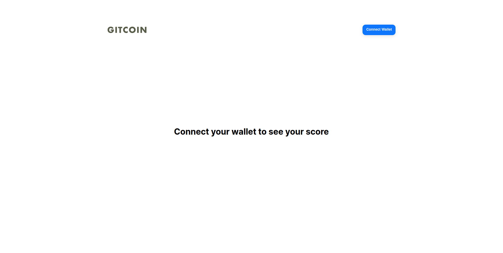

# Score Showcase

## Introduction

This sample app connects to a user's wallet, then fetches their passport score from the Passport Scorer API and displays it to them.

## Getting Started

### Create your API key and Scorer

1. Create your API key by going to [Gitcoin Passport Scorer](https://scorer.gitcoin.co) and clicking on the "API Keys" section.
   Then create a `.env.local` file and copy the contents of the `example.env.local` file into it.
   Replace `SCORER_API_KEY` with your API key.


2. Create a Scorer, by clicking on the "Scorer" section.
   Replace `NEXT_PUBLIC_SCORER_ID` with your Scorer ID in `.env.local`.


### Start the app

Now you can start the app by running:

```bash
cd examples/score-showcase && npm install
```

then

```bash
npm run dev
```

Finally, you can navigate to `http://localhost:3000` to view the sample app.



### Layout

Most of the logic for connecting to the Passport Scorer API can be found in `/components/score.js`

Inside this component we:

1. Fetch a message and nonce from the Passport Scorer API.
2. Prompt the user to sign the message.
3. Submit the user's passport for scoring.
4. Fetch the user's passport score.
5. Display the score to the user.

All of the interaction with the Passport Scorer API is proxied through our endpoints in `/pages/api`. This is done to prevent our `SCORER_API_KEY` env variable from being exposed to the frontend.
